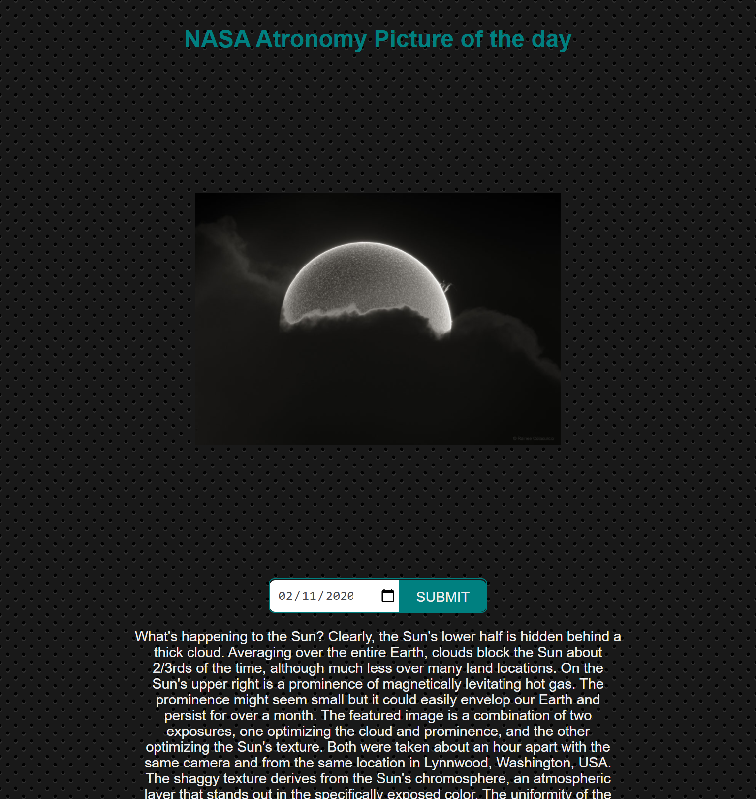
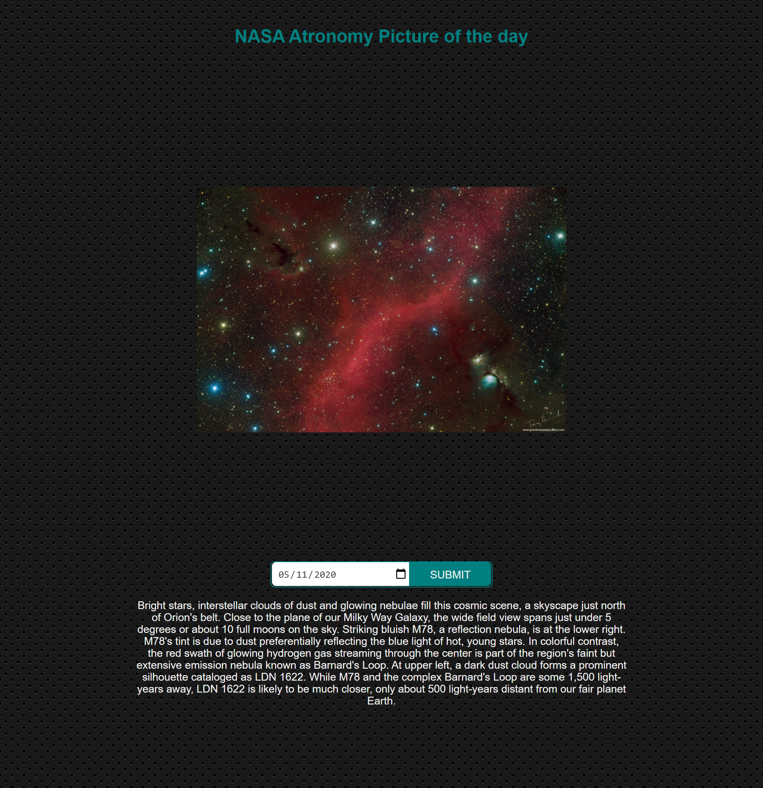

## Apod
This mini-app uses NASA's picture of the API to display an image/video and a description for selected days.

## Outline
## Outline
- [Live version](#Live-version)
- [UI Preview](#UI-Preview)
- [Technologies used](#Technologies)
- [Installation](#Installation)
- [Author](#author)
- [Licence](#licence)

## Live Version
The app ids deployed on netlify [here](https://apodnasa.netlify.app/)

## UI Preview

|                |                |
|----------------|----------------|
|||

## Technologies used
- React
- Redux
- Styled-components
- Typescript
- HTML
- CSS

## Installation
Follow the steps below run the game in a local environment; First ensure you have [Node.js](https://nodejs.org)installed.

1. Clone the repository from a terminal 
    ```git clone https://github.com/codecell/apod.git```.
2. Navigate to the project directory.
    ```cd apod```
3. Install project dependencies.
    ```yarn OR npm install```
4. Start and serve the development build.
    ```yarn OR npm start```
React app will automatically serve the compiled build on http://localhost:3000/ if the port is not in use, 
if port 3000 is occupied, React will take another randomly available port.

## Author

👤 **Alfred Ezaka**

- Github: [@codecell](https://github.com/codecell)
- Twitter: [@the_codecell](https://twitter.com/the_codecell) 
- Linkedin: [ezaka alfred](https://www.linkedin.com/in/alfrednoble/)

## Show your support

Give an ⭐️ if you like this project!
